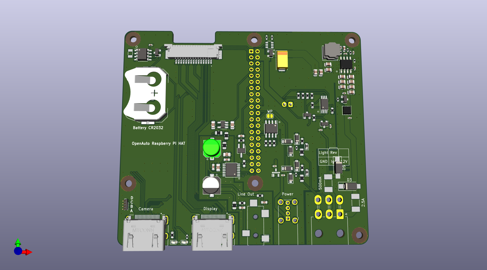
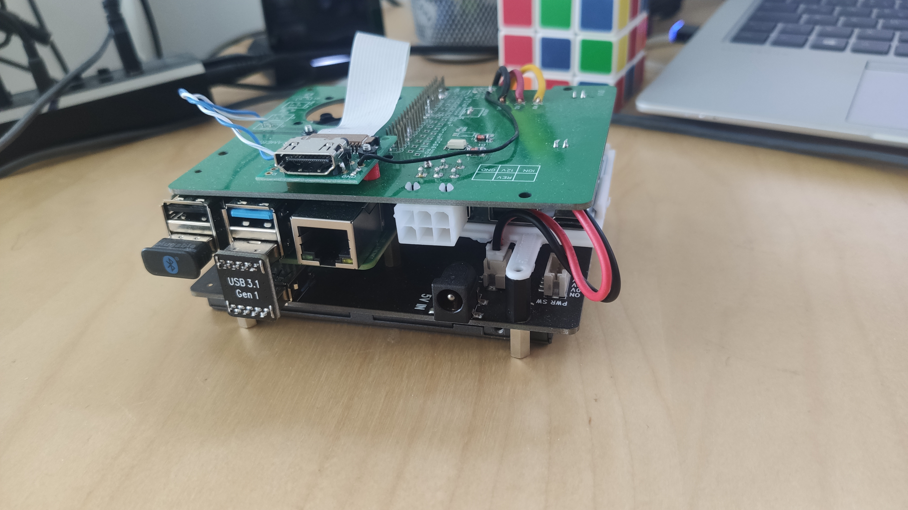

# Automotive power hat for OpenAuto

This hat is designed to work together with OpenAuto Pro and deliver some functionality which makes integrating OpenAuto into your car easier.

## Features

* Integrated 5A Power Supply
* Wide range power input (+7.5V to +40V)
* On-/Off circuit with ignition sensing
* 2 Digital inputs for e.g. reverse signal
* I2S sound
* RTC clock
* CSI to HDMI adapters to connect a display and camera
  * I2C bus availabe on the display connector for a light sensor
* Designed to fit exactly onto a [Geekworm x825](https://wiki.geekworm.com/index.php/X825) SSD V1 (Not tested with V2)

## ToDo

- [] ESD protection for inputs
- [] EMI
- [] Fuses
- [] Add 3D models for case and display to repo

## History

Here is a picture of prototype V1 with a Mouseberry power supply.

## Disclaimer

Due to the fact we are not providing a product in the legal sense, we are also not providing any warranty in any aspect.
